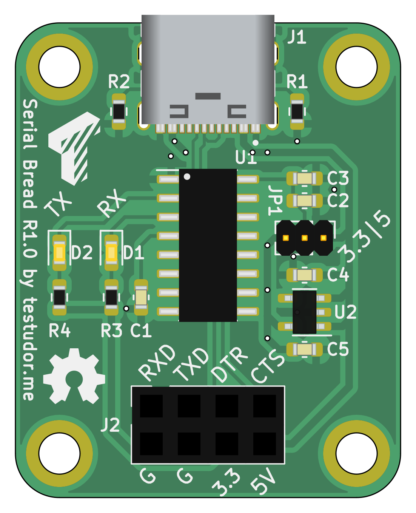
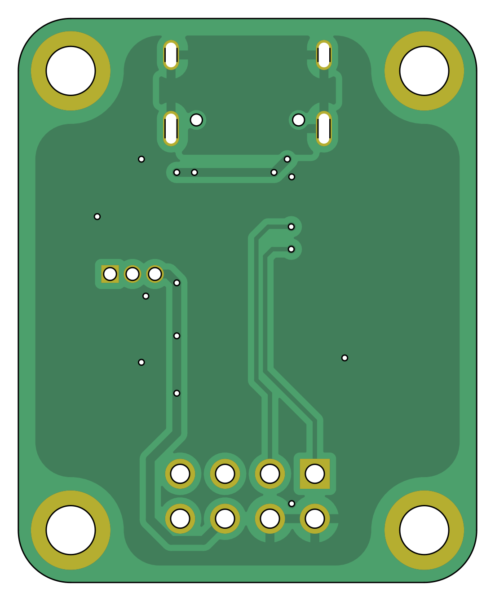

# Serial Bread

This is part of the "Modular Breadboard" parent project. 

It's a basic USB-to-UART adapter with a robust USB-C connector and switchable logic levels. It can also provide up to 3A@5v and 600mA@3<area>.3V for your project.
<!-- <area> prevents auto link generation caused by .3V -->

|  |  |
|:---:|:---:|
|Top|Bottom|
